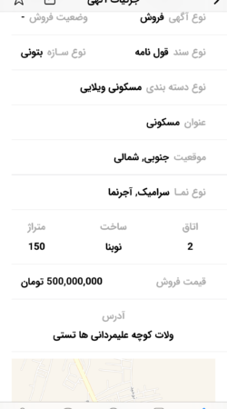
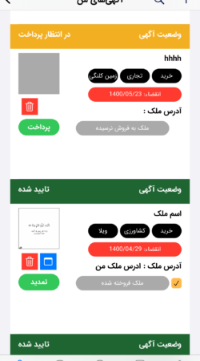
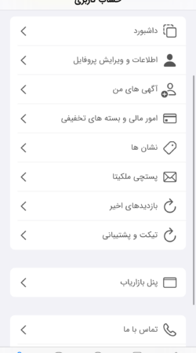

# 🏠 Melkita App - Buy, Sell, and Rent Properties

**Melkita App** is a comprehensive mobile application designed for buying, selling, and renting real estate properties. It provides a seamless user experience for property listings, communication between buyers and sellers, and managing rental agreements. Developed natively for **iOS** and **Android**, with a backend powered by **Node.js**, this app is your one-stop solution for all real estate needs. 🏡📱

---

## 🚀 Key Features

### 🔑 For Buyers
- Browse through thousands of property listings 🏘️
- Filter properties by location, price, type, and amenities 🗺️
- View detailed property information, including photos, descriptions, and prices 📸
- Save your favorite listings for easy access later ❤️

### 🔑 For Sellers
- Post property ads with detailed descriptions, images, and pricing 📋
- Manage your ads with tools to edit, delete, or renew listings ✏️
- Receive inquiries and communicate directly with buyers 💬

### 🔑 For Renters and Landlords
- List rental properties with terms and conditions 📑
- Search for rental opportunities by location and budget 🏠
- Manage rental agreements and receive updates 🕒

### 🔑 Additional Features
- **Secure Payments**: Pay or receive payments through a trusted payment gateway 💳
- **User Dashboard**: Manage all activities, listings, and inquiries from a single dashboard 📊
- **Notifications**: Stay updated with alerts on inquiries, favorite listings, and market trends 🔔

---

## 🎨 Screenshots

Here are some preview images of the Real Estate App:

🖼️ 
🖼️ 
🖼️ 
🖼️ 
🖼️ 

---

## 🛠️ Technologies Used

- **Frontend**: Native iOS (Swift) & Android (Kotlin)
- **Backend**: Node.js
- **Database**: MongoDB / PostgreSQL (if applicable)

---

## 📥 How It Works
1. **For Buyers**: Simply download the app, browse listings, and contact sellers or landlords directly.
2. **For Sellers**: Create an account, list your property, and receive inquiries from potential buyers.
3. **For Renters**: Search for rental properties and manage agreements all in one place.

---

## 📲 Download
- **iOS**: [Download Here](https://app.appleapps.ir/id/654611/)

---

## 📄 License
This project is a **demo version** and is intended for testing and evaluation purposes only. For commercial use or full access, please contact the development team.

🌟 **Experience the easiest way to buy, sell, or rent properties with Real Estate App!** 🚀

